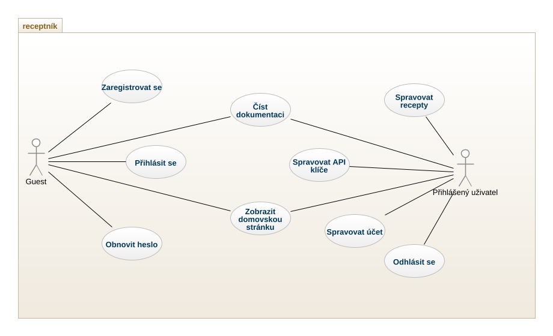
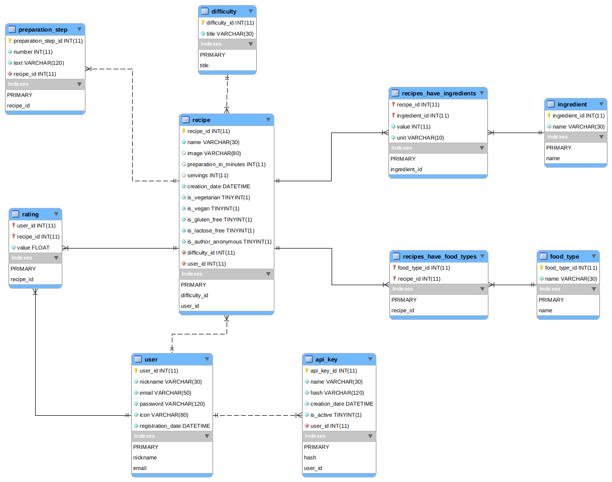

# Receptník

[](./LICENSE)

- Projekt do **EBC-PYT**.
- Webový portál, kde mohou uživatelé hledat recepty, hodnotit je či přidávat své vlastní.
- Aby mohli s recepty uživatelé pracovat, budou si muset na webu vytvořit účet, přes který budou tyto operace provádět.
- Kromě webového rozhraní pro uživatele aplikace obsahuje také receptové API, pro programátorské kolegy.
- V API si uživatelé mohou vytvořit svůj přístupový klíč a používat tak naši aplikaci pro své vlastní vývojářské účely.
- API slouží výhradně pro získávání receptů ve formě JSON/XML - nelze přes něj recepty mazat, vytvářet upravovat či
  hodnotit.
- Aplikace produkčně běží zde: http://www.receptnik.tk

## Autoři

- **Lucie Pacáková**
- **Lucie Suchánková**
- **Petr Chatrný**

## Použité technologie

|                |                                                                                                                                                                                                                                                                                                                                                                                                                                                            |
|----------------|------------------------------------------------------------------------------------------------------------------------------------------------------------------------------------------------------------------------------------------------------------------------------------------------------------------------------------------------------------------------------------------------------------------------------------------------------------|
| Frontend       |     |
| Backend        |                                                                                                                                                                                                                                                |
| Development DB |                                                                                                                                                                                                                                                                                                                                                |
| Production DB  |                                                                                                                                                                                                                                                                                                                                        |
| Server         |                                                                                                                                                                                                                                                                                                                                            |
| Hosting        |                                                                                                                                                                                                                                                                                                                                                |

## Sestavení aplikace

```bash
# získání zdrojového kódu
mkdir receptnik
cd receptnik
git clone https://vase_uzivatelske_jmeno@bitbucket.org/Lucie02/python-receptnik.git
cd python-receptnik

# nastavení virtuálního prostředí pythonu
python3 -m venv venv
. venv/bin/activate

# nainstalování závislostí
pip3 install -r requirements.txt

# nastavení enviromentálních proměnných
export FLASK_APP=src/app.py:app
export FLASK_ENV=development
export FLASK_DEBUG=1

# spuštění aplikace
flask run
```

## Sestavení aplikace - Docker

```bash
mkdir receptnik
cd receptnik
git clone https://vase_uzivatelske_jmeno@bitbucket.org/Lucie02/python-receptnik.git
cd python-receptnik

docker image build -t receptnik .
docker run -p 5000:5000 -d receptnik
```

## Případy užití



## ERD databáze receptníku



## Frontend routy

| Popis             | Metoda | Cesta                | Soubor                  | Veřejně dostupné |
|-------------------|--------|----------------------|-------------------------|------------------|
| Domovská stránka  | GET    | /                    | index.html              | ano              |            
| Seznam receptů    | GET    | /recepty             | recipe_list.html        | ne               |
| Recept detailně   | GET    | /recept/<id>         | recipe.html             | ne               |   
| Dokumentace       | GET    | /dokumentace         | documentation.html      | ano              |    
| Uživatelův profil | GET    | /uzivatel            | user.html               | ne               |    
| Přihlášení        | GET    | /prihlaseni          | login.html              | ano              |     
| Registrace        | GET    | /registrace          | register.html           | ano              |       
| Obnova hesla      | GET    | /obnova-hesla        | reset_password.html     | ano              |         
| Nové heslo        | GET    | /nove-heslo/<token>  | new_password.html       | ano              |           
| Vytvoření receptu | GET    | /vytvoreni-receptu   | create_recipe_form.html | ne               |            
| Úprava receptu    | GET    | /uprava-receptu/<id> | edit_recipe_form.html   | ne               |             
| Vytvoření klíče   | GET    | /vytvorit-klic       | key_form.html           | ne               |
| Odhlášeno         | GET    | /odhlaseno           | message.html            | ano              |
| Rozloučení        | GET    | /rozlouceni          | message.html            | ano              |

## API routy

| Popis                     | Metoda | Cesta                           | Soubor       | Dostupné s API klíčem |
|---------------------------|--------|---------------------------------|--------------|-----------------------|
| Přihlášení uživatele      | POST   | api/users/login                 | -            | ne                    |
| Odhlášení uživatele       | POST   | api/users/logout                | -            | ne                    |
| Registrace uživatele      | POST   | api/users/register              | -            | ne                    |
| Potvrzení registrace      | GET    | api/users/confirm-email/<token> | message.html | ne                    |
| Žádost o obnovu hesla     | POST   | api/users/forgot-password       | -            | ne                    | 
| Nastavit nové heslo       | POST   | api/users/<id>/update-password  | -            | ne                    | 
| Upravit uživatele         | PUT    | api/users/<id>                  | -            | ne                    |
| Smazat uživatele          | DELETE | api/users/<id>                  | -            | ne                    |
| Seznam receptů            | GET    | api/recipes                     | -            | ano                   |
| Detailní recept           | GET    | api/recipes/<id>                | -            | ano                   |
| Vytvořit recept           | POST   | api/recipes                     | -            | ne                    |
| Upravit recept            | PUT    | api/recipes/<id>                | -            | ne                    |
| Smazat recept             | DELETE | api/recipes/<id>                | -            | ne                    |
| Ohodnotit recept          | POST   | api/recipes/<id>/rate           | -            | ne                    |
| Seznam ingrediencí        | GET    | api/ingredients                 | -            | ano                   |
| Seznam typů jídel         | GET    | api/food-types                  | -            | ano                   |
| Vytvořit API klíč         | POST   | api/api-keys                    | -            | ne                    |
| Změnit aktivitu API klíče | POST   | api/api-keys/<id>/activation    | -            | ne                    |
| Smazat API klíč           | DELETE | api/api-keys/<id>               | -            | ne                    |
